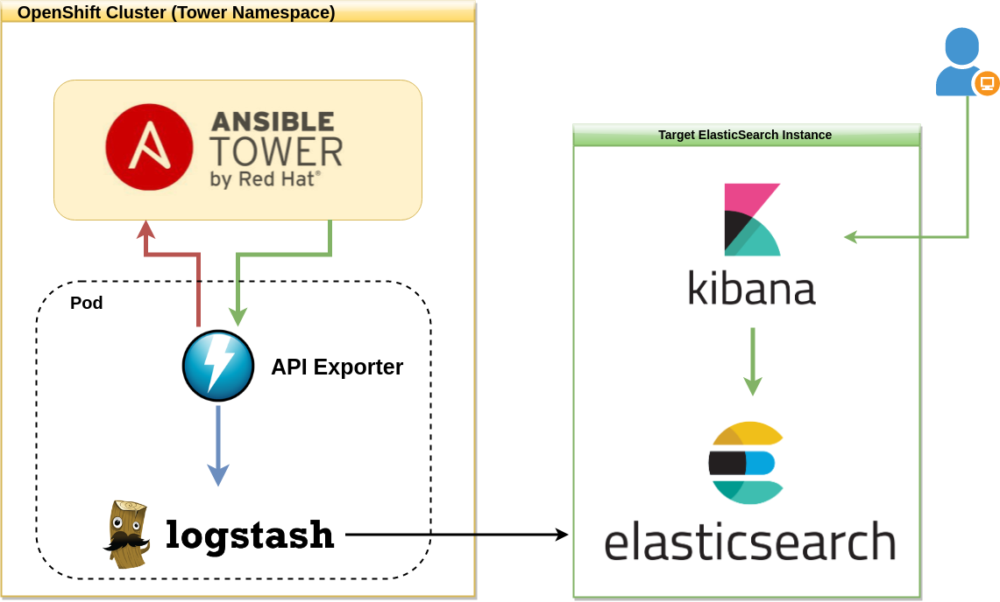

# logstash-exporter

This package implements a generic exporter to feed JSON data from a source API into a target Logstash instance.

As an initial example, this package extracts **Ansible Tower Inventory Data**, but any other source can be used we well, just as long it returns the content as JSON output to the main package.

## Docs

- [Usage](docs/usage.md)
- [Build Instructions](docs/build.md)

## Deploy

- [Docker](deploy/tower-metrics/docker/README.md)
- [OpenShift/Kubernetes](deploy/tower-metrics/charts/README.md)